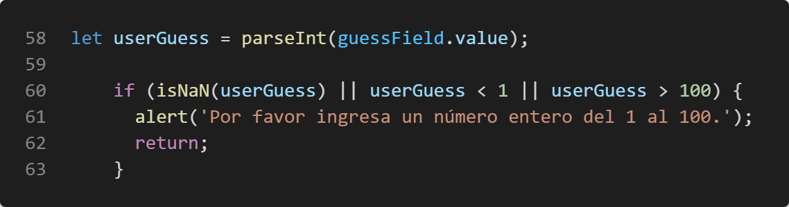

# Prueba técnica

El desarrollador implementó toda la interfaz gráfica, y así mismo la lógica del juego en el archivo index.html (Con HTML, Javascript y CSS), sin embargo el equipo de desarrollo cometió el error de no testear dicho proyecto, y lo colocaron en los servidores de producción. Para su sorpresa, al momento de que el cliente lo vió... ¡NO FUNCIONABA NADA! Dado a esta experiencia, el banco financiero contrató a un tester para realizar las pruebas respectivas con la finalidad de que el proyecto funcione correctamente de acuerdo a los requerimientos dados.


## Apertura de consola
- Se ingresó a la consola del navegador para verificar si el archivo tenia algún inconveniente mostraba un error en la consola del navegador en el archivo index.html en la línea 87.

	

- Se identificó que el método addeventListener se encontraba escrito incorrectamente y se modificó la letra E que debía de ser mayúscula en la palabra "event", la solución fue la siguiente:
	```
	guessSubmit.addEventListener('click', checkGuess);
	```


## Validación de input para ingreso de valores que pertenezcan al conjunto de enteros del 1 al 100

- Ingreso de letra: el input al ser de tipo texto permite el ingreso de caracteres alfanuméricos, por eso en la línea 31 en la parte del input type que actualmente se encuentra como "text" se cambió a "number", para que solo acepte el ingreso de números.

- En la línea 58 se parsea a Int para asegurar que la entrada sea un número entero, luego se hace la validación para que el número ingresado se encuentre en el rango de 1 a 100, 

	

	si devuelve un error que ingrese un número contenido en ese rango y si ingresa un decimal se redondeará al entero más cercano.

## Error en consola

- Se observó que en la consola del navegador muestra un error en la línea 85

	

 Este error se debe a que en la línea 49 se encuentra 
	```
	const lowOrHi = document.querySelector('lowOrHi');
	``` 
	y la manera correcta debe de ser 
	```
	const lowOrHi = document.querySelector('.lowOrHi');
	```
	ya que el punto (.) indica que la clase "lowOrHi" se está buscando en el documento HTML, mientras que sin el punto, se buscaría un elemento HTML con el nombre "lowOrHi".

- Cuando finalizan el intento ya se por no adiviar el numero o adivinar el numero, en la consola del navegador nos muestra un error en la función de "setGameOver" siendo el error en la línea 101 
	
	

	siendo el error la letra 'e' en addeventListener debe ser en mayúscula, por lo que la forma correcta sería 
	```
	resetButton.addEventListener('click', resetGame);
	```
	ya que la función addEventListener es sensible a mayúsculas y minúsculas

## Contador de oportunidades
- Se observó que la variable "ATTEMPS" que se encuentra en la línea 47 que es la que lleva el contador de los intentos está configurado solo para 5 intentos, entonces se realiza el cambio a 10 para que se tengan 10 oportunidades y lograr adivinar el número. 

## Mensajes y colores incorrectos
- Cuando se llegó a la cantidad de intentos máximos y no es el número correcto se muestra un mensaje incorrecto siendo este "Felicitaciones! adivinaste el número!" y el mensaje correcto debería de ser "!!!Pérdistes!!!", haciendo esta modificación en la línea 76. 

- Cuando se ingresa el numero correcto no se encontraba en la validación correcta en la línea 71 porque el userGuess debe de ser igual randomNumber para que se considere juego ganado, entonces se modificó el mensaje "!!!Pérdistes!!!" por el mensaje "Felicitaciones! adivinaste el número!" y el color del mensaje ya que anteriormente era negro y debe de ser verde.

- Para la validación si un número es mayor o menor en la línea 81 se tiene incorrecto el color del mensaje, el color actual es "green" y el correcto deberia de ser "black".


# Generación de número aleatorio

- En el script en la linea 44,el número aleatorio se genera de manera incorrecta, actualmente se genera de la siguiente manera 

	```
	let randomNumber = Math.random() * 10;
	```
	Math.random() genera un número aleatorio entre 0 y 1 (sin incluir el 1) y Math.floor() redondea ese número al entero más cercano. Como Math.random() nunca devuelve 1, el valor de randomNumber siempre será 1. Para generar un número aleatorio entre 1 y 100 se agregó la línea 
	```
	randomNumber = Math.floor(Math.random() * 100) + 1;
	```
	 para obtener un número aleatorio entre 1 y 100.

- En la función resetGame(), 
el número aleatorio se genera de manera incorrecta, actualmente se genera de la siguiente manera 
	```
	randomNumber = Math.floor(Math.random()) + 1;
	```
	Math.random() genera un número aleatorio entre 0 y 1 (sin incluir el 1) y Math.floor() redondea ese número al entero más cercano. Como Math.random() nunca devuelve 1, el valor de randomNumber siempre será 1. Para generar un número aleatorio entre 1 y 100 se agregó la línea 
	```
	randomNumber = Math.floor(Math.random() * 100) + 1;
	```
	 para obtener un número aleatorio entre 1 y 100.

